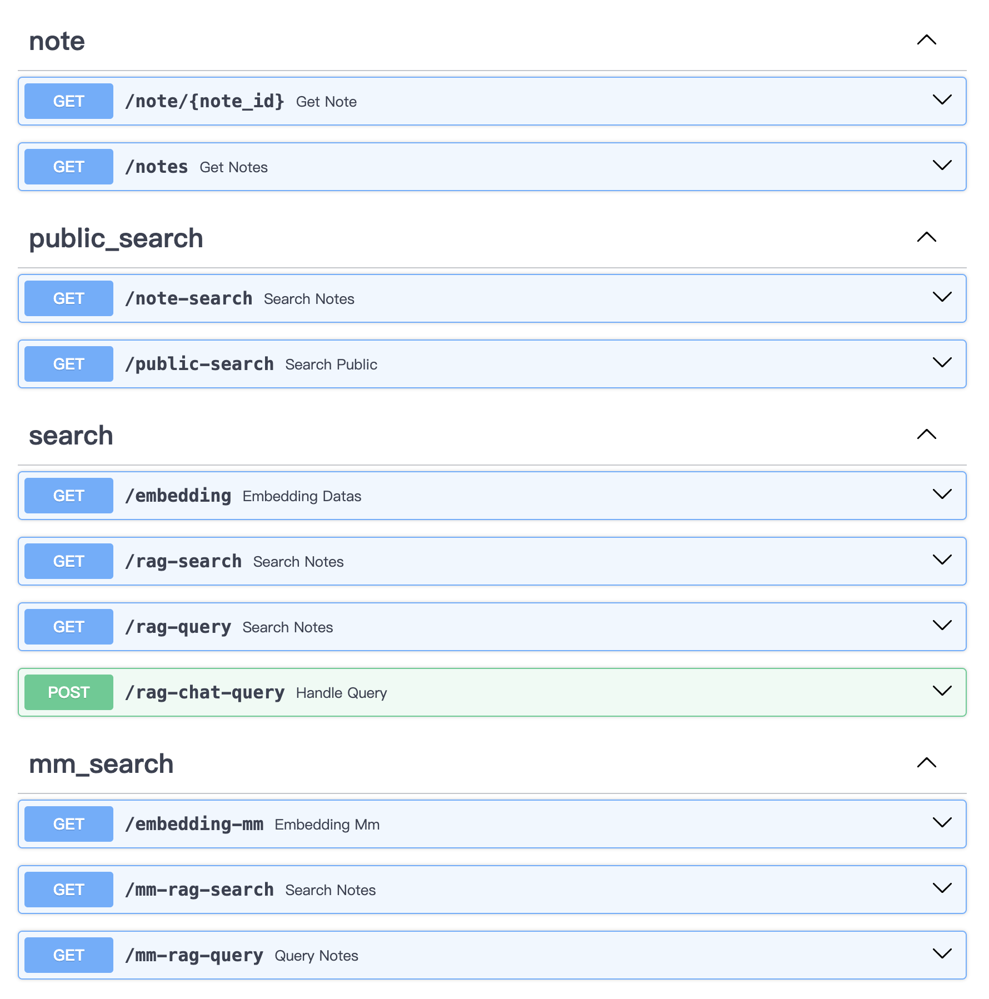

## mmrag_server Installation

**English** | [简体中文](./README.zh-CN.md)

#### Environment Installation

You can use [miniconda](https://docs.anaconda.com/free/miniconda/miniconda-install/) for a lightweight installation of the python conda environment.

```bash
# Install the virtual environment
conda create -n qmedia python==3.11
source activate qmedia

cd mmrag_server

# Install python dependencies
pip install -r requirements.txt
```

<br/>

#### Modify Configuration File

Edit the model configuration items:

```
cp config.py.local config.py
```

Modify the `config.py` configuration file according to your usage:

- use_video_service: Whether to use the video service, default is off
- use_google_search: Whether to use the Google search service

```python
@dataclass
class Configer:
    server_host = "localhost"
    server_port = 8001

    # ollama llm model name
    model_name = "llama3:8b-instruct-q4_0"
    # note: Large models can be used remotely
    # model_name = "llama3:70b-instruct"

    # multi model llm model
    mm_model_name = "llava-llama3"

    # ollama llm model host:port
    ollama_url = "http://localhost:11434"

    # mm_server host:port
    mm_server_url = "http://localhost:50110"

    # text embedding model
    embedding_model_name = "BAAI/bge-small-en-v1.5"

    store_host = "http://localhost:8001/medias"
    # pseudo data path
    json_file_path = str(TEMPLATE_PATH / "mm_pseudo_data.json")
    local_store_path = str(TEMPLATE_PATH / "medias")

    similarities_thre = 0.6

    # embedding storage path
    db_path = str(DB_PATH)
    db_index_id = "v1"
    docs_persist_path = str(DB_PATH / "docstore.json")

    # image embedding model
    clip_model_name = "ViT-B/32"

    # ocr model server
    ocr_model_name = "ocr"
    ocr_reader_base_url = mm_server_url

    # use video service
    use_video_service = False
    video_model_name = "faster_whisper"
    video_reader_base_url = mm_server_url

    # use google search
    use_google_search = False
```

#### Custom Data

```bash
# assets file structure
assets
├── mm_pseudo_data.json # Content card data
└── medias # Image/Video files
```

Replace the contents in `assets` and delete the historically stored `db` file.
`assets/medias` contains image/video files, which can be replaced with your own image/video files.
`assets/mm_pseudo_data.json` contains content card data, which can be replaced with your own content card data. After running the service, the model will automatically extract the information and store it in the `db`.

#### Run the Service

Depends on the [mm_server](../mm_server/README.md) service to run.

```bash
source activate qmedia
python main.py

# reload mode, hot update after modifying the code
# uvicorn main:app --reload --host localhost --port 8001
```

#### API Documentation:

http://localhost:8001/docs


<br/>

<div align="right">

[![][back-to-top]](../README.md)

</div>

[back-to-top]: https://img.shields.io/badge/-BACK_TO_TOP-151515?style=flat-square
